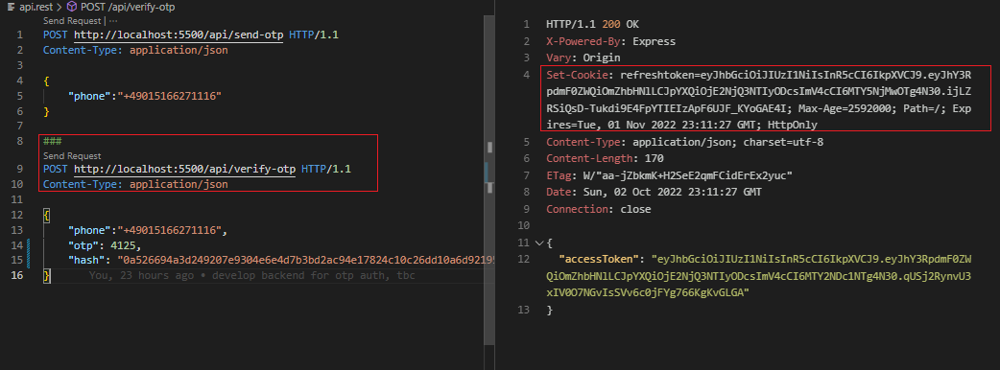

# coderhouse-mern

# VS Code extensions

REST Client

crypto.randomBytes(64).toString('hex') used to generate values of,
JWT_ACCESS_TOKEN_SECRET
JWT_REFRESH_TOKEN_SECRET

Verify otp method also sets the cookie with the refresh token.

Access token = JWT, store it in local storage and login the user.

Opt feature was effectively stored on the client, reducing db load.

User Redux tool kit for state management

Enable CORS middleware in BE to prevent the error by whitelisting the domain,
Also can use proxy option in front end.

data transform object (dto) - to tranform data before we send

cd into frontend
`yarn start`

cd into backend
`node server.js` or `yarn dev`

Part - 5 :

-   [x] Full name, profile pic upload,
-   [x] request server, to activate user,
-   [ ] once the current JWT expires, using refresh token we need to auto refresh it with axios.(this was done in part 6)

Notes for self :

1. To add the refresh token to db, we need a model.
   create a service to handle errors later on.
2. Check part 5 video 14:25 seconds to clarify about 'expires' variable.

The HttpOnly attribute is used to help mitigate against certain types of cross-site scripting (XSS) attacks by preventing client-side scripts from accessing the cookie. When the HttpOnly attribute is set on a cookie, it is not accessible to client-side scripts, such as JavaScript. This can help to reduce the risk of certain types of XSS attacks by preventing an attacker from being able to steal the cookie by injecting malicious script into the page.

Part - 6 :

-   [x] After page refresh, automatically user login.
-   [x] If Accesstoken is expired, how to use Refresh token and refresh Accesstoken
-   [x] Add progress bar, after clicking activate next - replace 1 second delay with animation

https://jakearchibald.github.io/svgomg/
was used to reduce the size of the original svg for the custom loader.

Part - 7/8 :

-   [x] fix some errors/issues.
-   [x] create modal for creating a new room. Store it in db
-   [x] retrieve all opened rooms to display to the dashboard.

Part - 9 :

-   [x] explanation about event listeners in web socket, ice candiate, p2p basic.

Part - 10 :

-   [x] create an audio element for every connected client
-   [x] websocket p2p connection
-   [x] create modal for creating a new room. Store it in db

Part - 11 :

-   [x] implementing webRTC connections

Notes for self :

1. Custom hooks @ 9 min
2.

Future Work

-   [ ] show user an alert to the end user. Why is the request not working.
        (for eg - all fields are required)
-   [ ] actions.js is repeated in both fe and be folder
